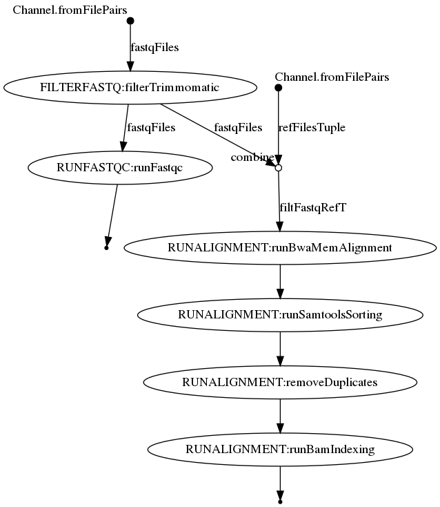

## FastqToBam Pipeline: fastqToBam

fastqToBam is a nextflow-based pipeline which combines multiple open-source tools to generate the final alignent starting from the paired-end Illumina sequences (Phred scale encoded using ASCII 33 to 93). It filters the raw fastq files (using sickle or trimmomatic), obtain the qualitative statistics of the sequences (using fastqc), align the filtered fastq files to the reference (using bwa), and remove the duplicates (using picard). The pipeline can be run smoothly on LRZ linux HPC. Further details are provided below: 

## Requirements:
Nextflow (version 21.10.0 or higher, https://www.nextflow.io/)\
Conda (tested on 4.12.0, https://docs.conda.io/projects/conda/en/latest/index.html)

## The pipeline in brief:

**Main Module file** : fastqToBam.nf
**Main config file** : fastqToBam.config; the reference (which should be indexed using "bwa index" before running the pipeline) and the fastq files to be processed should be set here. 

**Module 1**). FILTERFASTQ

parameter file: ./parameters/filterFastq.config
module file: ./modules/filterFastq.nf
default parameters : useFiltTool (type = String, the filtering tools to be used to filter the sequences, default is "Trimmomatic", option = "Trimmomatic", "Sickle")

**Process 1.1** filterSickle
tool used: sickle (v 1.33)
parameters: qualType ("-t",default: sanger), qualThreshold, ("-q", default: 20), lenThreshold ("-l", default: 20), noFivePrime (default: "No", "-x" if "Yes"), truncateN (default: "No", "-g" if "Yes"), gzipOut ("-g", default: "Yes")
conda installation file : ./conda/sickle.yaml

**Process 1.1** filterTrimmomatic
tool used: trimmomatic (v 0.39)
parameters: all the major parameters as specified in the reference manual of Trimmomatic (http://www.usadellab.org/cms/?page=trimmomatic or http://www.usadellab.org/cms/uploads/supplementary/Trimmomatic/TrimmomaticManual_V0.32.pdf)
conda installation file : ./conda/trimmomatic.yaml

**Module 2**). RUNFASTQC

parameter file: ./parameters/runFastqc.config
module file: ./modules/runFastqc.nf

**Process 2.1** runFastqc
tool used : fastqc (v 0.11.9) 
parameters: min_length (set to 0), contaminant file, adapter file and limit file not included (-c, -a and -l flags, respectively), the value of kmers (set to 7, default value), location of temporary folder for the fastqc (fastqcTmpDir) and the location of the output files of the fastqc (fastqcResultsOut)
conda installation file: ./conda/fastqc.yaml


**Module 3**). RUNALIGNMENT

Parameter file: ./parameters/runAlignment.config
module file: ./parameters/runAlignment.nf
default parameters : tmpFolder (type = PATH, the path to the folder in which a separate folder for each processing sample will be created; these folders will be used as temp for the "samtools sort" and "picard MarkDuplicates" processes), finalFilteredBamFiles (type = PATH, the path to the existing folder in which the final filtered bam files will be copied )

**Process 3.1** runBwaAlnAlignment
tool used: Bwa mem (v 0.7.17)
parameters: all the default parameters of bwa mem
conda installation file: ./conda/bwa.yaml
Other remarks: During this step, read group info, "RG, SM and PL:Illumina", tags wil be added. RG and SM will be assign the value of the sample name. 

**Process 3.2** convertSamToBam
tool used: samtools (v 1.14)
conda installation file: ./conda/samtools.yaml

**Process 3.3** removeDuplicates
tool used: picard (v 2.27.2)
conda installation file: ./conda/picard.yaml

**Process 3.4** runBamIndexing
tool used: samtools (v 1.14)
purpose: generate index of the filtered bam files generated in the previous process. 
conda installation file: ./conda/samtools.yaml



## Options for running the pipeline on Linux HPC
In the nextflow.config file, the profile "cluster" has been added to take into account the SLURM executor.The user can change and optimized the resources mentioned under different labels (such as "oneCpu", "sixteenCpus"). If you change these labels, also remember to apply these changes in the respective module file.  If the HPC has been more than one cluster, then user should export the appropriate cluster variables, in case of SLURM, it could be, "export SLURM_CLUSTERS=inter", before running the pipeline. 

## Installation and dependencies
To run this pipeline, users need to have conda and nextflow installed. After clonning this repository, the user need to run the following command

```sh
nextflow run -qs 1 fastqToBam.nf -with-dag -profile cluster -bg
```
By default, the program will use conda to install the dependencies and run the pipeline. 

## License

MIT

